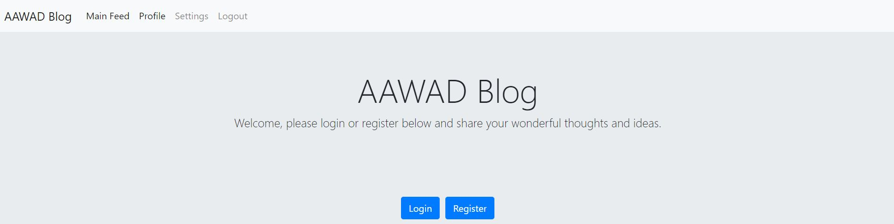

# aawadblog

<h1 align="center">Overview</h1>
  

AAWADBlog is a blog website with features, including creating posts, adding a comment, and liking posts.

This application was build using the React library, including components and hooks. All of the components used in this project are custom.
The app's backend uses Nodejs with express js as the used framework. User and content data are stored in MongoDB using Mongoose.

 

<h1 align="center">Backend</h1>

 

The backend uses essential packages to send, receive, or store and parse data, including body-parser, and packages to connect the backend with the frontend, including cors and path.
 

 

<h2>Models/Collections</h2>

 
 

The Database includes three main collections/models, which are <em>users, posts, and comments</em>.

 

 

<em>Users</em> collection has parameters including:
<ul>
 <li>username</li>
 <li>hash</li>
 <li>salt</li>
 <li>serverHash</li>
 <li>serverSalt</li>
 <li>email</li>
 <li>displayName</li>
 <li>aboutUser</li>
 <li>profileImgData</li>
 <li>Gender</li>
 <li>BirthDay</li>
 <li>BirthMonth</li>
 <li>BirthYear</li>
 </ul>
 
 
<em>Username, hash, salt, and email</em> are the <strong>minimum requirements</strong> to create a new user. 
Username and email must be <em>unique</em>, and the username and the email address uniqueness gets checked on both frontend and backend.
The other parameters are optional, and users can set them through the frontend by visiting their <em>settings pages</em>.
 

 
 

 
 

<em>Posts</em> collection has parameters including:
 <ul>
  <li>title</li>
  <li>content</li>
  <li>dateAdded</li>
  <li>publisher</li>
  <li>userID</li>
  <li>likers</li>
  </ul>
  
  
<strong>All of these parameters are required</strong> expect likers array. 
<em>Likers</em> parameter is an array that accepts user IDs. Each ID added represents an additional like.
This array stores user IDs to ensure <em>no user can like a post twice</em>. User ID gets compared in the frontend with the pool of IDs in the array.

 

 

Comments collection has parameters including:
 
 
 <ul>
  <li>content</li>
  <li>dateAdded</li>
  <li>owner</li>
  <li>userID</li>
  <li>relatedPostID</li>
  </ul>
  
  
  <strong>All of these parameters are required</strong>. <em>Related post ID</em> determine which posts comments are related to.

 
 

<h2>Routes</h2>

REST API is applied in two router, <a href="#Auth">/auth/</a> and <a href="#Api">/api/</a>.

<h3 id="Auth">Auth Route</h3>

Auth route call Mongoose methods to get, add, edit, or delete data of the <em>users</em> collection. All the data that is sent from the server to the frontend are send in JSON format using <em>res.json(<response>)</em>

 
<h4>NPM Packages</h4>

 Unique npm packages that is used in this route, includes <em>bcrypt, moment, multer, and AWS.</em>
 

<table>
 <tr>
  <th>NPM Package</th>
  <th>Description</th>
 </tr>
 
 <tr>
  <td id="Bcrypt"><a href="https://www.npmjs.com/package/bcrypt">Bcrypt</a></td>
 <td>This package is a well-known package to generate a <em>random salt</em> that gets determined based on the <em>number of hashing rounds</em> required. The salt and the string data, which should be protected, get used as input to <em>generate a hash.</em> Moreover, the hash generation process gets done by the <a href="https://en.wikipedia.org/wiki/Blowfish_(cipher)#:~:text=Weakness%20and%20successors-,The%20algorithm,which%20uses%20fixed%20S%2Dboxes.">Blowfish</a> hashing algorithm.</td>
  </tr>
  
  <tr>
  <td id="Moment"><a href="https://www.npmjs.com/package/moment">Moment</a></td>
 <td>This package is used to send an <em>expiration date</em> of the user info that gets stored in the <em>local storage.</em> Moment calculates the date and time value after a specific period. Moreover, in this project, the period is set to <em>24 hours.</em></td>
  </tr>
  
  <tr>
   <td id="Multer"><a href="https://www.npmjs.com/package/multer">Multer</a></td> 
 <td>Multer is used to <em>uploading file</em> data to specific storage. In this app, file data gets stored in <em>memory storage.</em> Then the image data gets prepared to be upload to an <em>AWS S3 Bucket.</em></td>
 </tr>
 
 <tr>
 <td id="AWS-SDK"><a href="https://www.npmjs.com/package/aws-sdk">AWS-SDK</td>
 <td>By getting <em>req.file</em>, which gets available after the <em>Multer Package</em> file uploading process ends, this data gets uploaded in <em>AWS S3 Buckets.</em> The upload request to S3 Bucket requires using <em>authorization keys</em> and sending Bucket data, including region and Bucket name.</td>
</tr>
</table>

  
 
 

 <h4>RESTfull Requests</h4>
 
The main REST API requests are listed below:

<table>
 
 
 <tr><th>Route</th><th>Description</th></tr>
 
 
 <tr>
  <td id="/auth/get-all-users/">/auth/get-all-users/</td> 
 <td>
This is a <strong>GET request</strong> that sends an <em>array</em> of user information,  including <em>usernames and emails.</em> This request is initiated from the <a href="#Register">register</a> view/page to ensure the username and email <em>uniqueness.</em>
   
</td>
 </tr>

 <tr>
  <td id="/auth/create-user/">/auth/create-user/</td>
 <td>
This is a <strong>POST request</strong> to create a <em>new user document</em> with a <em>username, an email, salt, hash, server salt, and serverHash.</em> In this project, I applied a <em>double hashing</em> to ensure password security. Salt and hash data get sent from the frontend, and then another salt "server salt" gets created in the backend to generate a hash of the sent hash, which is the <em>serverHash.</em>
</td>
 </tr>
 
 
 <tr>
  <td id="/auth/get-user-id/">/auth/get-user-id/</td>
 <td>
This is a <strong>POST request</strong> to send the <em>user ID</em> associated with a <em>username.</em>
</td>
 </tr>
 
 
 <tr>
  <td id="/auth/server-user-info/">/auth/save-user-info/</td>
 <td>
This is a <strong>PATCH request</strong> to update user information with data, including the user's <em>display name, about and gender.</em>
</td>
 </tr>
 
 
 <tr>
  <td id="/auth/save-profile-image/user/usedID/">/auth/save-profile-image/user/:userID/</td>
 <td>
This is a <strong>PATCH request</strong> that updates user's stored profile image data. The process uses <a href="#Multer">Multer</a> and <a href="#AWS-SDK">AWS-SDK</a> packages to receive the data file and upload it to <em>Amazon's cloud storage</em>
</td>
 </tr>
 
 
 <tr>
  <td id="/auth/get-external-user-info/">/get-external-user-info/
 </td><td>
This is a <strong>POST request</strong> used to send user information, including display name, about, gender, and birthdate, to the frontend.
</td>
 </tr>
 
 
 <tr>
  <td id="/auth/display-profile-image/">/auth/display-profile-image/</td>
 <td>
This is a <strong>POST request</strong> used to send the profile image data required to access the uploaded image in Amazon's cloud storage.
</td>
 </tr>
 
 
 <tr>
  <td id="/auth/get-salt/">/auth/get-salt/</td>
 <td>
This is a <strong>POST request</strong> to <em>send a salt</em>, which is associated with a specific username. This salt is required in the frontend to complete the <a href="#Login">login</a> process. If no salt gets sent back, that indicates the fact that the username entered was <em>not registered previously.</em></tp></td>
 </tr>
 
 
 <tr>
  <td id="/auth/verify-user/">/auth/verify-user/</td>
 
 This is a POST request that receives and verifies a hash with the stored hash for a user. The hash value, along with the user's server salt, gets inputted to Bcypt's Hash method to generate and hash. Then, the generated hash gets compared to the stored server hash, and if there is a match, then login is successful.
 <td>
This is a <strong>POST request</strong> that receives and <em>verifies a hash with the stored hash for a user</em>. The hash value, along with the user's server salt, gets inputted to <a href="#Bcrypt">Bcypt</a>'s Hash method to generate and hash. Then, the generated hash gets compared to the stored server hash, and if there is a match, then login is successful.
</td>
 </tr>
 
 
 </table>
 
 
 

 

<h3>API Route</h3>

API route calls Mongoose methods to get, add, edit, or delete data of both <em>posts and comments</em> collections.

 

<h4>NPM Packages</h4>

There are no npm packages used in this route other than <em>express and body-parser</em>

 

<h4>RESTfull Requests</h4>

The main REST API requests are listed below:

<table>
 <tr>
  <th>Route</th>
  <th>Description</th>
 </tr>
 
 
 <tr>
  <td id="/api/get-posts/">/api/get-posts/</td>
  <td>
This is a <strong>GET request</strong> to get all the post documents to render them on the <a href="#Feed">feed</a> page/view.
</td>
 </tr>
 
 <tr>
  <td id="/api/get-posts-by-user-id/">/api/get-posts-by-user-id</td>
 <td>
 
This is a <strong>POST request</strong> to get all the posts of the user that hold the received user ID. These posts get displayed in the user's <a href="#Profile">profile</a> page/view.

  </td>
 </tr>
 
 <tr>
  <td id="/api/create-post/">/api/create-post/</td>
 <td>
This is a <strong>POST request</strong> to create a new post and add it as a document to the <em>posts collection.</em> This request gets intiated from <a href="#NewPostInput">NewPostInput</a> Component.
</td>
 </tr>
 
 <tr>
  <td id="/api/delete-post/:postID/">/api/delete-post/:postID/</td>
 <td>
This is a <strong>DELETE request</strong> to delete the post with the sent <em>postID parameter.</em>
</td>
 </tr>
 
 
 <tr>
  <td id="/api/edit-post/">/api/edit-post/</td>
 <td>
This is a <strong>PATCH request</strong> to edit the <em>post title, the content, or both.</em>
</td>
 </tr>
 
 
 <tr>
  <td id="/api/get-comments/">/api/get-comments/</td>
 <td>
This is a <strong>GET request</strong> that renders all the comments for each post in the <a href="#CommentSection">CommentSection</a>
</td>
 </tr>
 
 
 <tr>
  <td id="/api/add-comment/">/api/add-comment/</td>
 <td>
This is a <strong>POST request</strong> to create a new comment and add it as a document to the <em>comments collection. This request gets intiated from the <a href="#CommentInput">CommentInput</a> component.
</td>
 </tr>
 
 
 <tr>
  <td id="/api/delete-comment/:commentID">/api/delete-comment/:commentID/</td>
 <td>
This is a <strong>DELETE request</strong> to delete the comment with the sent <em>commentID param.</em>
</td>
 </tr>
 
 
 <tr>
  <td id="/api/edit-comment/">/api/edit-comment/</td>
 <td>
This is a <strong>PATCH request</strong> to edit the comment content of the comment that has the sent comment ID
</td>
 </tr>
 
 
</table>

 
 

 
 
 

<h1 align="center">Frontend</h1>
 

The frontend users React and React-DOM libraries to render the pages. The pages render 7 main views and an 8th one that redirects users to the home view in all cases.
 
The app uses <a href="https://www.npmjs.com/package/react-router-dom">react-router-dom</a> package, including BrowserRouter, component is used to link views with paths.

 
<h2 id="Views">Views</h2>
 
This is a list of the views with the related path:
<table>
<tr>
<th>View</th><th>Path(s)</th>
</tr>
<tr>
 <td><a href="#Home">Home</a></td><td>/home/</td>
</tr>
<tr>
 <td><a href="#Register">Register</a></td><td>/register/</td>
</tr>
<tr>
 <td><a href="#Login">Login</a></td><td>/login/</td>
</tr>
<tr>
 <td><a href="#Logout">Logout</a></td><td>/logout/</td>
</tr>
<tr>
 <td><a href="#Feed">Feed</a></td><td>/feed/</td>
</tr>
<tr>
 <td><a href="#Profile">Profile</a></td><td>/profile/user/:username</td>
</tr>
<tr>
 <td><a href="#Settings">userSettings</a></td><td>/settings/user/:username</td>
</tr>
<tr>
 <td><a href="#Unspecified">Unspecified</a></td><td>/profile/user/ /settings/user/</td>
</tr>
</table>
 
<quote>Note that the <a href="https://www.npmjs.com/package/axios">Axios</a> npm package gets used in all the HTTP requests initiated from the frontend.</qoute>
<h3 id="Home"><a href="https://aawadblogapp.herokuapp.com/">Home</a></h3>

This view is simple, and it consists of only two components, which are the <a href="#Navbar">navbar</a> and the <a href="#WelcomeMsg">greetingMessage</a>.
 The page asks the user to login or register in order to proceed to the <a href="#Feed">feed</a> page.

 

 
<h3 id="Login"><a href="https://aawadblogapp.herokuapp.com/login">Login</a></h3>

This view consists of two components only, which are the <a href="#Navbar">navbar</a> and the <a href="#WelcomeMsg">greetingMessage</a>.

 
<h4>Process</h4>

If users are <em>already logged in</em> and attempt to reach the <a href="#Login>login</a> page, they get redirected to the <a href="#Feed">feed page</a>. <quote>The user is considered logged in if there is user data in the <em>local storage</em></quote>

 
If the user is <em>not already logged in</em>, the only two user inputs required are the username and the password. Any changes happening to the username or the password inputs get recorded in the <em>defined states</em> for each. 
 When the user hits the <em>submit button</em>, the login method gets called from auth.server.js with username, password, and warning state action methods as input.

Furthermore, an HTTP-request to the route <a href="/auth/get-salt/">/auth/get-salt/</a> gets initiated to get the <em>stored salt</em> for the user associated with the sent username. If <em>no user is found</em>, the <em>username warning</em> state gets set to true, and the warning will appear as shown below. 

If salt is found, it gets sent as data in response to the HTTP-request. <em>The salt then, along with the password</em>, enters as input to the <a href="https://www.npmjs.com/package/bcryptjs">Bcryptjs</a> pkg hash method. Then, the output hash gets sent with the username to verify that the hash used for this specific used calculated a server hash that shares the same value with the stored server hash for the user.

Finally, if the hashes match, the <em>successful login flag</em>, that has its action method also sent, gets set to true. The flag gets checked in an if statement in the loginUser "submit handler" method. Else, if the hash is not matching, a password warning will show up as shown below.

 

 

 
 <h3 id="Register"><a href="https://aawadblogapp.herokuapp.com/register">Register</a></h3>

This view consists of two components only, which are the <a href="#Navbar">navbar</a> and greeting message.

 
<h4>Process</h4>

If users are <em>already logged in</em> and attempt to reach the <a href="#Login">login page</a>, they get redirected to the <a href="#Feed">feed page</a>. <quote>The user is considered logged in if there is user data in the local storage</quote>

If the user is <em>not already logged in</em>, the only user inputs required at this point to complete the registration are <em>username, password, and email.</em> <quote>"All of the inputs get stored in states."<quote> Each of these inputs should pass the validation process, which calls a method from auth.validation.js. 
 Furthermore, <em>username and email</em> gets compared to the stored values, in the pool of usernames and emails sent as a response from the HTTP request with the <a href="#/auth/get-all-users/">/auth/get-all-users/</a> route. As shown in the figure below, if a user types a username or an email that is already registered in the system, a live warning would appear.

 
 

  The email must have <em>a valid structure</em>, and this is verified by calling a method called isEmail from the <a href="https://www.npmjs.com/package/validator">Validator</a> npm package. This method returns <em>a boolean value.</em> If the email is not valid, a warning would appear as shown below.

 

The final validation is related to the password. The password requirements are listed below:
<ul>
<li>Password length must be higher than or equal to 10 characters.</li>
<li>Password must include, at least, one number.</li>
<li>Password must include, at least, one lowercase letter.</li>
<li>Password must include, at least, one uppercase letter.</li>
<li>Password must include, at least, one special character.</li>
<li>Some special characters as whitespaces are not permitted.</li>
</ul>
If the user fails to follow the above rules and attempts to submit for registration, an alert appears with all of these rules as shown below.
These rules get displayed using <em>Bootstrap to show a tooltip</em> when the user is hovering on the password input. State action methods, along with the password, get entered as an input to the <em>custom validatePassword method.</em>

Moreover, in validatePassword method some arrays, including <em>lowercase letters, uppercase letters, special characters, number characters, unallowed characters, </em>get defined and filled with integer numbers that are mapped to characters, using the fromCharCode method, based on the ASCII table.

 The password gets passed to the method and gets transformed into an <em>array of characters using the spread operator.</em> After that, the process begins to check whether the password meets the requirements. 
 <h5>Password Length Validity</h5>
First, the <strong>password length requirment</strong> get checked by reading the length of the array of characters. 
<h5>Number, Lowecase, Uppercase, and Special Characters Validity</h5>
Then, for each of the other rules, <em>"for loop" statements</em> are set to go over all of the array input until there are <em>no inputs left</em> or the find method return one of the password characters that have a matching character with one of the other array inputs. If<em> a match is found</em>, the <em>break statement</em> breaks the process out of the loop, also, <strong>CharacterFlag</strong> gets set to true, indicating that the password meets a specific requirement. On the other hand, if there was no match, then the password does not meet the specific requirement. 
<h5>Unallowed Characters Check</h5>
In the same way, the <strong>unallowed character</strong> array gets compared to the array of characters, but unlike the other checks, if a match is found, and unallowed character is set to true, then the password does not meet this requirement. Else, if no match is found, then the user meets the requirements. 

The <em>entered username and email</em> get their letter cases lower to lowercase, and the same process happens in the login views. In the <a href="#Register">registration</a> view, this process happens before the validation and before the submission to the HTTP request. That is done using the npm package <a href="https://www.npmjs.com/package/lodash">lodash</a>, specifically <em>toLower method.</em> 
Also, if there are whitespaces in the username input data, the whitespaces get removed using <em>the replace method of Lodash</em>, which replaces " " with "". That is all done to improve the user experience. 

After that, the inputs get passed when calling register method from auth.service.js, and these inputs get used as data in the POST HTTP request with the path <a href="#/auth/create-user/">/auth/create-user/</a>. The registration process intiates the login proces automatically 
Finally, the user gets redirected to the <a href="#Login">Login view</a>, and if the user was logged in successfully, the user gets redirected to the <a href="#Feed">Feed</a> view. 

 

 
<h3 id="Logout">Logout</h3>

This view consists of only one component, which is the naviagation bar. Also, it contain jumbotron and animation wheel from Bootstrap 4.5 CDN. This is to enhance user experience, and invite the user to reuse the app

 
<h4>Process</h4>

The process here is simply showing the jumbotron content in a 2-second period before redirecting the user to the home page

 

 
<h3 id="Feed"><a href="https://aawadblogapp.herokuapp.com/feed">Feed</a></h3>

This view consists of only three components, which are the <a href="#Navbar">navigation bar</a>, the <a href="#NewPostInput">NewPostInput</a>, and the <a href="#Post">Post</a> components. Also, it contains a jumbotron that welcomes the users and mentions their usernames. </h3>
 
<h4>Process</h4>

If users who <em>aren't logged in</em> attempt to reach the <a href="#Feed">Feed</a> page, they get redirected to the login page. <quote>The user is considered logged in if there is user data found in the <em>local storage</em></quote> The user data might be available in the storage. If the <em>expiration</em> date for the user login is less than the value of the current time of the compression process, the user gets removed and logged out. The user login session expires after one day of their login. 

If the <em>user is logged in</em>, the page will render normally. It will continue <em>rendering continuously</em> due to the update of the defined <em>posts array</em> which is a dependency of <em>the second useEffect</em> in the code. This improves the user experience by rendering <em>live content</em>. The posts array gets its content from the GET HTTP request with the path <a href="#/api/get-all-post/">/api/get-all-post/</a>. 
Each of the posts gets its object data sent as a parameter of the <a href="#Post">Post</a> components. The map method gets the information of each post and passes the info in individual <a href="#Post">Post</a> components.  
The <a href="#NewPostInput">NewPostInput</a> component appears above the content while passing the <em>username and userID</em>, to have them as input for the required HTTP request in the component. 

 

 
<h3 id="Profile">Profile</h3>

This view consists of only four components, which are the navigation bar, the profileImage, the newPostInput, and the Post components. Also, it contains jumbotron that show user information including username/display name and about statement.

 
<h4>Process</h4>

If users are <em>not already logged in</em> and attempt to reach the <a href="#Feed">Feed</a> page, they get redirected to the <a href="#Login">login page<Login>. <quote>The user is <em>considered logged in</em> if there is user data in the <em>local storage</em></quote>

If the user is logged in, similarly to the <a href="#Feed">Feed</a> page, posts will keep re-rendering to show <em>live content</em>. <em>useEffect</em> hook keeps the page re-rendering due to the <em>continuous update</em> of the posts array

Besides the posts, the <a href="#NewPostInput">NewPostInput</a> component won't appear unless the <em>current user ID</em>, which is stored in the <em>local storage</em>, matches the user ID of the profile owner. The user ID of the profile's owner is provided as a response of the POST HTTP request of the path <a href"#/auth/get-user-id/">/auth/get-user-id/</a>. 
Also, the <em>user setting button</em> located in the <em>upper left corner</em> won't appear unless the current user is the profile owner

 
<h3 id="Settings">userSettings</h3>

This view consists of only six components, which are <a href="#Navbar">navigation bar</a>, <a href="#BootstrapTextInput">BootstrapTextInput</a>, <a href="#Label">Label</a>, <a href="#Dropdown">Dropdown</a>, <a href="#ImageInput>ImageInput</a>, and <a href="#ProfileImage">ProfileImage</a>.

 

 
<h4>Process</h4>
 
If users are not already logged in and attempt to reach the <a href="#Feed">Feed</a> page, they get redirected to the <a href="#Login">login</a> page. The same will happen if the signed-in user is <em>not the target user</em> of the <a href="#Settings">settings</a> page.

Each of the components takes some inputs. Furthermore, <strong><a href="#Dropdown">Dropdowns</a> take arrays, including days, months, years, and genders, <a href="#BootstrapTextInput">BootstrapTextInputs</a> take the label text, <a href="#Labels">Labels</a> take description texts, and <a href="#ProfileImage">profile image</a> takes the state value for the image.</strong> The <a href="#Dropdown">dropdowns</a> get description paramater. 
All of the components in the <a href="#Setting">settings</a> view get sent state values and state action methods as params. Also, setDaysAccordingToMonth function gets sent as a parameter for the months dropdown. It's not called in the <a href="#Dropdown">Dropdown</a> component's handler functions unless the description params are <em>"birth-month".</em> 
Moreover, whenever the month dropdown value gets set <em>setDaysAccordingToMonth</em> gets called with the selected month as the input. The value, then, gets used as an input to a switch statement, which sets the number of the days according to the selected month.

<em>Components</em> set the state values to use the <em>action methods</em> sent. There are two buttons included in the <a href="#Settings">settings</a> view. One is labeled <em>"Clear Image"</em> in case the user <em>doesn't want to use an image anymore</em>, and the other is the </em>submit button</em> that is located in the <em>top left corner of the screen</em> to match the location of the settings button in the <a href="#Profile">profile</a> page. 
When submit button is clicked, two HTTP requests gets called, which are the requests with the routes <a href="#/auth/save-user-info/">/auth/save-user-info/</a> and <a href="#/auth/save-profile-image/">/auth/save-profile-image/</a>.

Finally, whenever the <a href="#Settings">settings</a> page refreshes, the stored information, which are retrieved from the HTTP requests with the routes <a href="#/auth/get-external-user-info/">/auth/get-external-user-info/</a> and <a href="#/auth/display-profile-image/">/auth/display-profile-image/</a>, gets rendered in the page. That <em>improves the user experince.</em>

 

 
<h3 id="Unspecified">Unspecified</h3>

This view doesn't have any components and only returns empty 
. If users attempt to reach this view, they get redirected to the <a href="#Home">home</a> page. With an alert indicating that the page is not available.

 

 
 
<h2>Components</h2>

Here is a list of the custom components exported:
<ul>
<li><a href="#Navbar">Navbar</a></li>
<li><a href="#WelcomeMsg">WelcomeMsg</a></li>
<li><a href="#Post">Post<a/></li>
<li><a href="#NewPostInput">NewPostInput</a></li>
<li><a href="#CommentSection">CommentSection</a></li>
<li><a href="#Comment">Comment</a></li>
<li><a href="#CommentInput">CommentInput</a></li>
<li><a href="#ProfileImage">ProfileImage</a></li>
<li><a href="#BootstrapTextInput">BootstrapTextInput</a></li>
<li><a href="#Dropdown">DropDown</a></li>
<li><a href="#ImageInput">ImageInput</a></li>
<li><a href="#Label">Label</a></li>
</ul>

<h3 id="Navbar">Navbar</h3>

Navbar include links to all of the <a href="Views">views</a>. Login and registers appear in <a href="#Login">Login</a>, <a href="#Register">Register</a>, and <a href="#Logout">Logout</a> views only, while the other links appear in the rest of the views only.

 

 
<h3 id="WelcomeMsg>WelcomeMsg</h3>

The message welcomes the user a specific action required from the user, whether it's <em>login, register, or both.</em>

 

 
<h3 id="NewPostInput">NewPostInput</h3>
This component accepts the user input of both post's title and post's content. When the user hits submit, if both title and content inputs have text, a POST HTTP request with the path <a href="#/api/add-post/">/api/add-post/</a> get sent with the input. If one of or both inputs does not have values, <em>warning labels appear.</em>
 

 

 
<h3 id="Post">Post</h3>

<a href="#Post">Post</a> components, as mentioned previously in the description for <a href="#Feed">Feed</a> and <a href="#Profile">Profile</a> views, get its data from the posts array, which gets mapped into separate array entries using the Map method

<h4>Structure & Process</h4>

Post gets the parameters, <em>content, title, date, publisher "username", post user ID, current user ID, Likers "Array of user IDs", and post ID</em>

This information is used to structure each post. The <em>post ID</em> is used in the PATCH HTTP request with the path <a href="#/api/edit-post/">/api/edit-post/</a>. The <em>length of likers</em> array determine the <em>number of likes.</em> 
The current used ID gets <em>compared to</em> the IDs in the likers array. furthermore, if the <em>user ID</em> is not found in the array, this indicates that the <em>user did not like the post already</em>, and the user can like the post.
That will initiate the POST HTTP request with the route <a href="/api/add-like/">/api/add-like/</a>. On the other hand, if the current user ID matches one of the IDs in the array, the <em>user can unlike</em> the post by intiating the http request <a href="#/api/remove-like/">/api/remove-like/</a>

The user ID is sent with a POST HTTP request with the route <a href="#/auth/get-user-external/">/auth/get-user-external/</a> info and a POST HTTP request with the route <a href="#/auth/get-user-profile-image/user/:userID/">/auth/get-user-profile-image/user/:userID/</a> to get the <em>user display name, gender, and profile image.</em> 
<em>Display name</em> will be displayed instead of the publisher username if available. The image will be displayed if available; otherwise, a <em>default image</em> will be rendered based on the gender of the publisher. 
Finally, <a href="#Post">Post</a> component links to the <a href="#CommentSection">CommentSection</a> which appears and disappears, with jQuery/DOM animation applied, by clicking on the comments button.

 

 
<h3 id="CommentSection">CommentSection</h3>

<a href="#CommentSection">CommentSection</a> keeps re-rendering the page with <em>live comments</em> by continuesly upadding the comments array. 
This component includes both <a href="#CommentInput">CommentInput</a> and <a href="#Comment">Comment</a> components. The <a href="#Comment">Comment</a> component gets multiplied depending on the <em>comments array's length.</em>

 

 
<h3 id="CommentInput">CommentInput</h3>

CommentInput can be used for either adding a comment with content only or editing a comment once triggered from the Comment component.

 

 
<h3 id="Comment">Comment</h3>

Comment display comment content and either <<em>display name or username.</em> If the current user in the <em>local storage</em> matches the user ID associated with the comment, two control buttons, <em>edit or remove</em>, get displayed to the user 
Furthermore, the edit function triggers a state the let the <a href="#CommentInput">CommentInput</a> switch to edit mode, and when the edit button gets clicked, a PATCH HTTP request with the path <a href="#/api/edit-comment/">/api/edit-comment/</a> update the comment content for the comment with the sent comment ID 
<strong>Delete button</strong> send a DELETE http request with the route <a href="#/api/delete-comment/:commentID/">/api/delete-comment/:commentID/</a>

 

 
<h3 id="ProfileImage">ProfileImage</h3>

ProfileImage set the image state with the user image the return as a result of the POST http request with the path <a href="#/auth/get-user/profile-image/user/:userID/">/auth/get-user/profile-image/user/:userID/</a>.

 

 
<h3 id="BootstrapTextInput">BootstrapTextInput</h3>

This component receives label text as param and set the states using the sent state action method.

 

 
<h3 id="Dropdown">Dropdown</h3>

This component receives an array of strings and use the map method to create option elements, based on the array length, within the select element.

 

 
<h3 id="ImageInput">ImageInput</h3>

Image input accepts either <em>jpeg or png filemimes.</em> The file data then gets stored into a new file object that changes the name of the image to <em>match the username and sets the extension as a jpeg.</em> 
Furthermore, the URL object of the image sets the image state to let users preview images before submission. Also, the image data and name gets appended in a FormData object, which gets used by the <a href="#Multer">Multer</a> package in the backend to store the image in the <em>memory storage before it is handled by AWS S3.</em>

 

 
<h3 id="Label">Label</h3>

Label simply displays whatever text sent by the label text param.

 

 
 
